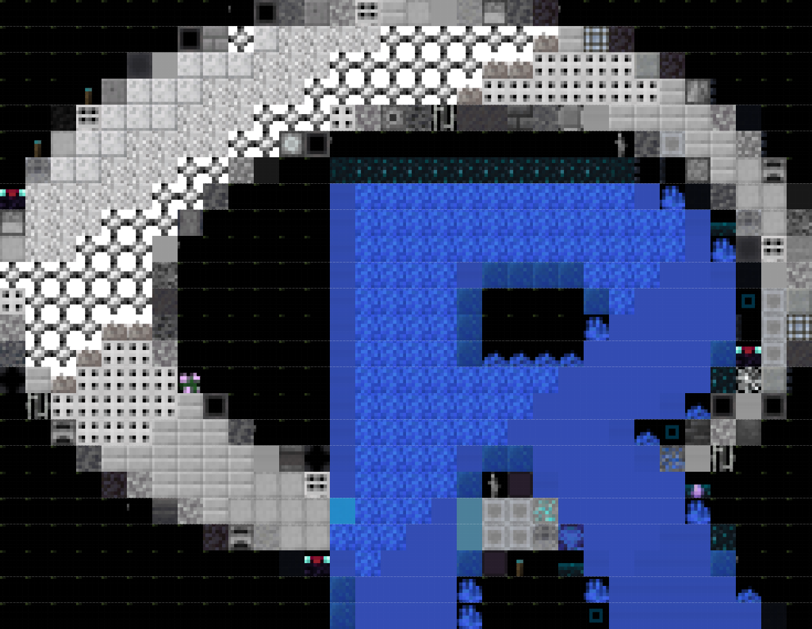

# PictureToMinecraft
## Description
This is the sister/inspiration package to tobyhayward13/PictureToDice. 
This takes a .png image and converts it to a Minecraft block image map
Appropriate credit to the author of the textures @ Mojang/bedrock-samples

Using some very simple functions in this package, we can convert this image into a Minecraft block face map:
```
file = system.file("pictures", "pngexample.png", package="PictureToMinecraft")
image = ImportPicture(file)
image.conv = ConvolutePixels(image,40)
image.prepped = PrepareMinecraftMap(image.conv)
PlotMinecraftMap(image.prepped)
```

